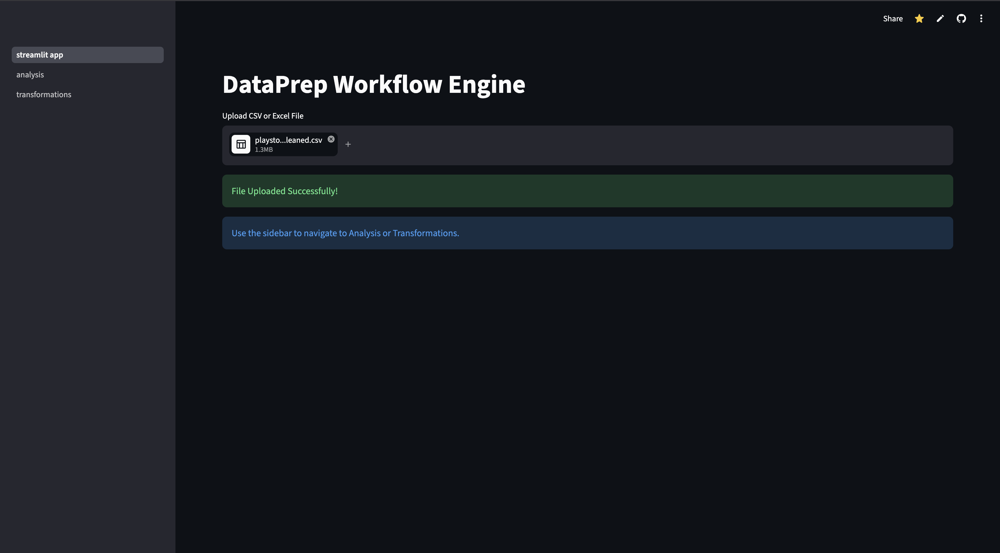
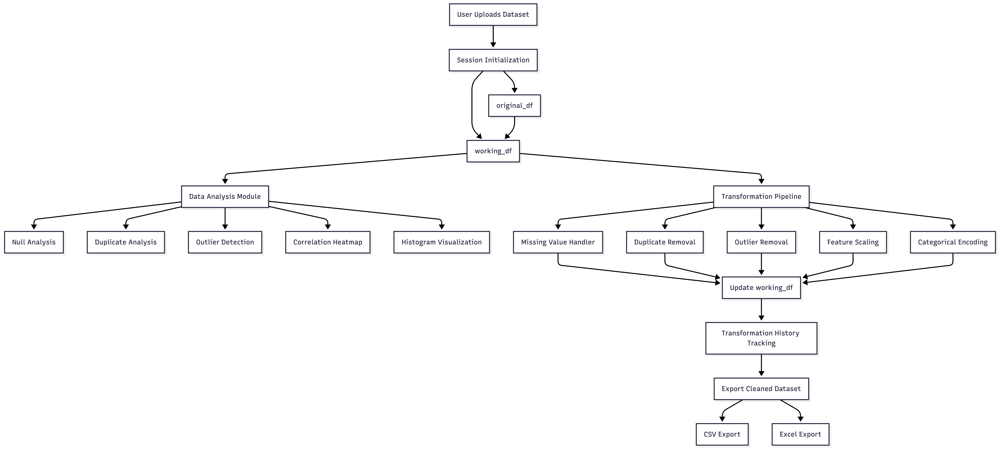
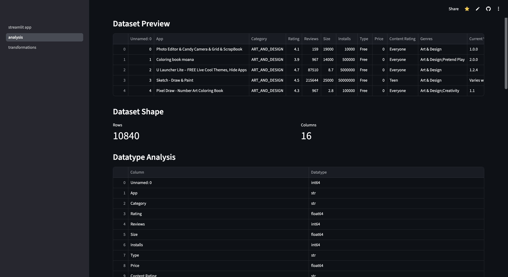
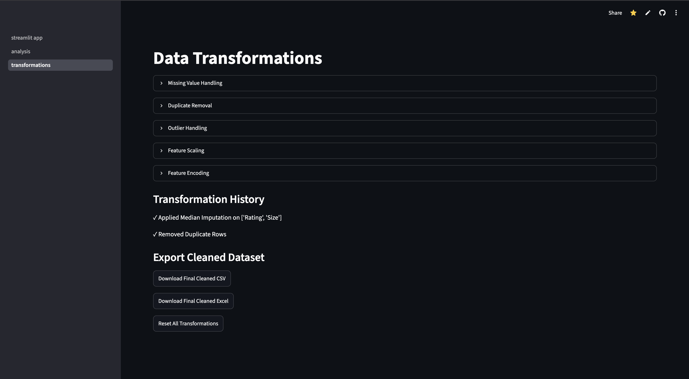
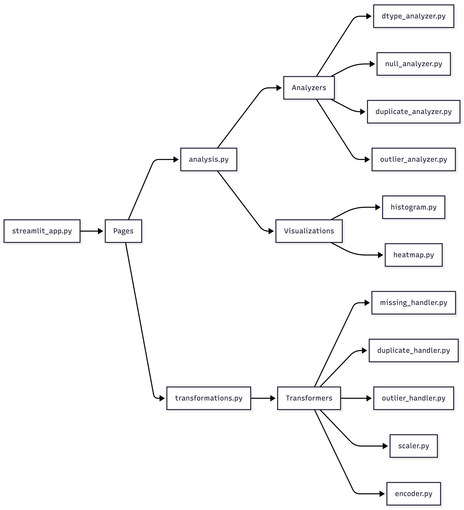

<div align="center">

# DataPrep Workflow Engine

---

## Analyze • Transform • Export

<br>


</div>



---

# Table of Contents

- [Project Overview](#project-overview)
- [Problem Statement](#problem-statement)
- [Workflow Pipeline](#workflow-pipeline)
- [Key Features](#key-features)
- [Analysis Page Features](#analysis-page-features)
- [Transformation Page Features](#transformation-page-features)
- [System Architecture](#system-architecture)
- [Tech Stack](#tech-stack)
- [Engineering Concepts Implemented](#engineering-concepts-implemented)
- [Future Improvements](#future-improvements)
- [Conclusion](#conclusion)

---

# Project Overview

Real-world datasets are often messy, inconsistent, and not directly suitable for machine learning or analytical workflows. Data scientists and analysts typically spend significant time performing repetitive preprocessing tasks such as:

- Handling missing values
- Removing duplicates
- Detecting and removing outliers
- Scaling numerical features
- Encoding categorical variables
- Understanding dataset structure and quality

Most beginner EDA tools focus only on visualization and static analysis. However, they lack a proper preprocessing workflow architecture where transformations are applied sequentially and preserved throughout the session.

The **DataPrep Workflow Engine** solves this problem by providing a **stateful preprocessing pipeline system** that allows users to:

- Analyze datasets interactively
- Apply sequential transformations
- Preserve transformation state
- Track preprocessing history
- Export final cleaned datasets

The application behaves more like a lightweight preprocessing workflow engine rather than a simple visualization dashboard.

---

# Problem Statement

Traditional EDA dashboards typically suffer from several limitations:

- Transformations are not persistent
- Data resets after interactions
- No sequential preprocessing pipeline
- Lack of workflow transparency
- Limited preprocessing capabilities
- Poor support for iterative cleaning workflows

This project addresses these limitations through:

- Stateful session management
- Sequential transformation architecture
- Modular preprocessing pipeline design
- Transformation history tracking
- Interactive preprocessing workflows

---

# Workflow Pipeline



---

# Key Features

## I) Stateful Sequential Transformation Pipeline

The application maintains two separate datasets throughout the workflow:

### `original_df`
- Stores the raw uploaded dataset
- Never modified
- Serves as the source of truth

### `working_df`
- Stores transformed data
- Updated after every preprocessing step
- Used throughout the transformation pipeline
- Exported as the final cleaned dataset

This architecture enables true sequential preprocessing workflows.

## II) Multi-Page Application Architecture

The application is divided into separate workflow-focused pages:

| Page | Purpose |
|------|----------|
| Home | Dataset upload and session initialization |
| Data Analysis | Exploratory Data Analysis and visualizations |
| Data Transformations | Sequential preprocessing and export workflows |

---

# Data Analysis Features

The **Data Analysis** module provides interactive exploratory data analysis capabilities.



## I) Dataset Preview
- Displays dataset head
- Provides quick overview of uploaded data

## II) Dataset Shape Metrics
- Total rows
- Total columns

## III) Datatype Analysis
- Detects column datatypes
- Helps identify categorical and numerical features

## IV) Null Value Analysis
- Displays missing value counts per column
- Helps identify incomplete features

## V) Duplicate Analysis
- Detects exact duplicate rows
- Helps identify redundant records

## VI) Unique Value Analysis
- Displays unique feature counts
- Shows cardinality levels
- Helps guide encoding decisions

## VII) Outlier Analysis
- Uses IQR-based outlier detection
- Detects numerical anomalies

## VIII) Histogram Visualization
- Interactive histogram plotting
- Numerical feature distribution analysis

## IX) Correlation Heatmap
- Multi-column correlation analysis
- Dynamic heatmap visualization

---

# Data Transformation Features

The **Data Transformations** module enables sequential preprocessing workflows.



## I) Missing Value Handling

Supported strategies:

- Mean Imputation
- Median Imputation
- Mode Imputation
- Row Deletion

## II) Duplicate Removal

- Removes exact duplicate rows
- Maintains dataset consistency

## III) Outlier Removal

Uses:

- IQR (Interquartile Range) Method

Features:
- Column-wise outlier removal
- Numerical feature filtering

## IV) Feature Scaling

Supported scaling methods:

- MinMax Scaling
- Standard Scaling

Implemented using:

- `scikit-learn.preprocessing`

## V) Feature Encoding

Supported encoding methods:

- Label Encoding
- One-Hot Encoding

Features:
- Automatic categorical feature handling
- Integer-based encoded outputs
- Dynamic feature expansion

## VI) Transformation History

Tracks all preprocessing steps applied during the session.

Example:

```text
✓ Applied Mean Imputation on ['Age']
✓ Removed Duplicate Rows
✓ Applied Standard Scaling on ['Salary']
✓ Applied One-Hot Encoding on ['City']
```

This provides workflow transparency and preprocessing traceability.

## VII) Reset Pipeline

Allows users to reset all transformations and restore the original uploaded dataset.

## VIII) Export System

Supported export formats:

- CSV
- Excel (.xlsx)

Users can download the fully cleaned and transformed dataset after preprocessing.

---

# System Architecture



The project follows a modular architecture for scalability and maintainability.


```text
data-prep-workflow-engine/
│
├── streamlit_app.py
│
├── pages/
│   ├── analysis.py
│   └── transformations.py
│
├── analyzers/
│   ├── dtype_analyzer.py
│   ├── null_analyzer.py
│   ├── duplicate_analyzer.py
│   ├── unique_analyzer.py
│   └── outlier_analyzer.py
│
├── transformers/
│   ├── missing_handler.py
│   ├── duplicate_handler.py
│   ├── outlier_handler.py
│   ├── scaler.py
│   └── encoder.py
│
├── visualizations/
│   ├── histogram.py
│   └── heatmap.py
│
└── requirements.txt
```

---

# Tech Stack

| Technology | Purpose |
|------------|----------|
| Python | Core programming language |
| Streamlit | Interactive web application framework |
| Pandas | Data manipulation and preprocessing |
| NumPy | Numerical operations |
| Matplotlib | Data visualization |
| Seaborn | Statistical plotting |
| Scikit-learn | Preprocessing and ML utilities |
| OpenPyXL | Excel export functionality |

---

# Engineering Concepts Implemented

This project demonstrates several important software engineering and machine learning workflow concepts:

- Stateful Session Management
- Sequential Data Pipelines
- Modular Application Design
- Interactive Data Processing
- Workflow-Oriented Architecture
- Reusable Transformer Design
- Multi-Page Streamlit Applications
- Persistent Transformation Pipelines

---

# Future Improvements

Potential future enhancements include:

- Pipeline export as Python code
- Undo/Redo preprocessing steps
- Smart preprocessing recommendations
- Datatype conversion utilities
- AutoML integration
- Workflow save/load functionality
- Pipeline templates
- Advanced visualization modules

---

# Conclusion

The **DataPrep Workflow Engine** is designed as a lightweight interactive preprocessing workflow system that bridges the gap between traditional EDA dashboards and real-world data preparation pipelines.

The project emphasizes:

- Sequential preprocessing workflows
- Stateful data transformations
- Modular engineering practices
- Interactive preprocessing pipelines

rather than focusing solely on static visualizations.

This architecture makes the system scalable, reusable, and extensible for future machine learning workflow enhancements.

# ⭐ If you found this project interesting, feel free to star the repository!
